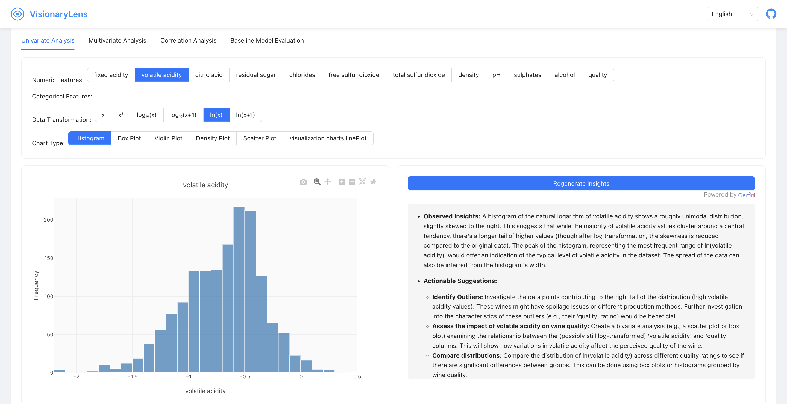
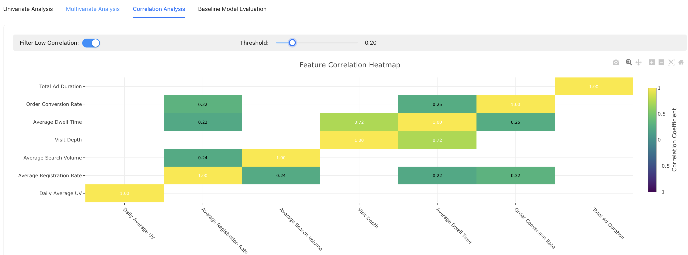

## Features
- 📁 CSV/Excel file upload support
- 📊 Interactive data visualization
- 🔍 AI-powered data insights
- 🤖 Automated baseline model comparison
- 🌍 Internationalization support (🇺🇸🇯🇵🇨🇳)
## Demo
### File upload

### Univariate analysis with AI insights

### Multivariate analysis with AI insights

### Heatmap 

### Model comparison

## Tech Stack

### Frontend
- Vite + React
- Ant Design
- Plotly
- i18next

### Backend
- Flask
- Python
- Pandas, Scikit-learn, XGBoost, etc.
- Google Gemini AI

## Local Deployment
```
git clone https://github.com/civilix/VisionaryLens
```
### Frontend
```
cd frontend
npm install
npm run dev
```
### Backend
```
cd backend
```
```
#Create a virtual environment(optional)
python -m venv venv
source venv/Multin/activate
```
```
#Install the dependencies
pip install -r requirements.txt
python app.py
```
### Environment Variables
Create a .env file in the backend directory and add the following variables:
```
GOOGLE_API_KEY="your_gemini_api_key"
```

