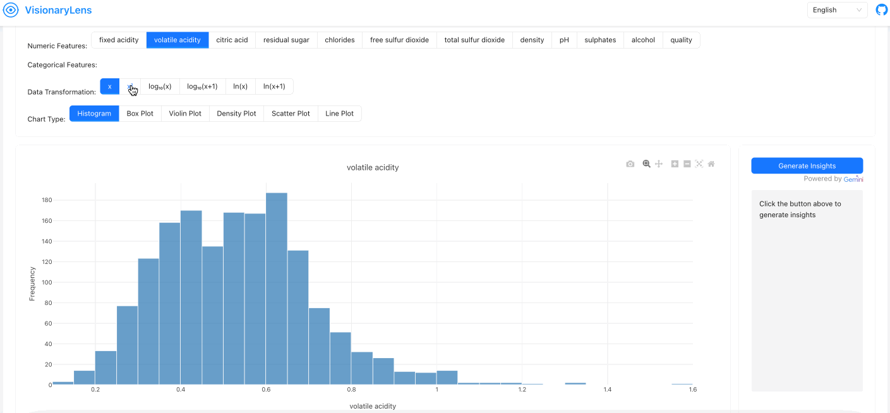

## Features
- 📁 **CSV/Excel File Upload**: Seamlessly upload your data files for analysis.
- 📊 **Interactive Data Visualization**: Engage with your data through dynamic visualizations.
- 🔍 **AI-Powered Data Insights**: Leverage AI to gain deeper insights into your data.
- 🤖 **Automated Baseline Model Comparison**: Automatically compare models to establish a performance baseline.
- 🌍 **Internationalization Support**: Available in multiple languages (🇺🇸 English, 🇯🇵 Japanese, 🇨🇳 Chinese).

## Demo
### File Upload


### Interactive Data Visualization


### AI-Generated Insights


### Multivariate Analysis


### Heatmap Visualization


### Model Comparison

Data undergoes simple feature engineering and standardization, followed by PCA for dimensionality reduction. `RandomizedSearchCV` is used to compare model performance bounds.
## Tech Stack

### Frontend
- Vite + React
- Ant Design
- Plotly
- i18next

### Backend
- Flask
- Python
- Pandas, Scikit-learn, XGBoost
- Google Gemini AI

## Local Deployment

### Clone the Repository
```bash
git clone https://github.com/civilix/VisionaryLens
```

### Frontend Setup
```bash
cd frontend
npm install
npm run dev
```

### Backend Setup
```bash
cd backend
```
#### Create a Virtual Environment (Optional)
```bash
conda create -n VisionaryLens python=3.11 -y
conda activate VisionaryLens
```

#### Install Dependencies
```bash
pip install -r requirements.txt
python app.py
```

### Environment Variables
Create a `.env` file in the backend directory and add the following variables:
```plaintext
GOOGLE_API_KEY="your_gemini_api_key"
```

